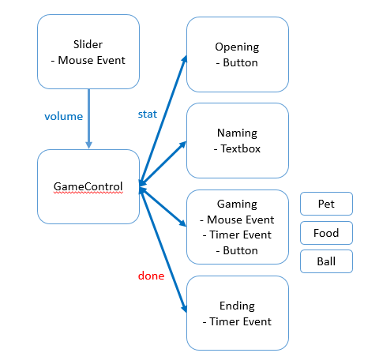

# Proposal
- 組別3
- 組長：李泓燁
- 組員：邱詠智、楊鈞愷
- 遊戲名稱：Can Your Seafood?

## 遊戲描述
- 遊戲性質：溫馨療癒的養成遊戲
- 遊戲簡介：
	- 資工系生活苦悶嗎?
	- Final毫無希望嗎?
	- Deadline壓得你喘不過氣嗎?
	- 這款遊戲將讓玩家創建屬於自己的萌寵，可以替萌寵穿上最具個人特色的配件與飾品，還可以一天八餐餵食萌寵，把萌寵養得白白胖胖的，更可以與萌寵互動玩球球!!
	- 最重要的是，藉由與萌寵互動，可以提升與萌寵間的好感值，好感值達到一定程度將會觸發驚喜彩蛋事件!!
	- 整個遊戲將讓玩家能放鬆身心，暫時脫離俗世的喧囂、組員的咆哮與學霸的恥笑，獲得seafood萌寵的療癒，還能夠感受到培育萌寵的成就感唷!!
- 遊戲流程：替萌寵取名字→與萌寵互動(換裝、餵食、玩球球)→好感值上升→特殊彩蛋事件

## 主架構

## Class列表和簡介
- `GameControl`：用有限狀態機維護遊戲運行到哪個階段
- `Interface`：對於每個階段的遊戲畫面建立專屬的class，`Interface`為 Virtual Class
	- `Opening`：開頭動畫/選單
	- `Naming`：取名字的遊戲階段
	- `Gaming`：與萌寵互動、增加感情的階段
	- `Ending`：遊戲結束，restart
- `Circle`：座標(x, y, r)，做為Object裡面的元素
- `Object`：對於每個遊戲物件都建立專屬的class，`Object`為 Virtual Class
	- `Button`：按鈕
	- `Pet`：可愛的萌寵
	- `Ball`：跟你的萌寵玩球球
	- `Food`：餵你的萌寵吃好料
	- `Slider`：滑桿，控制音量大小之類的
	- `Textbox`：讓你輸入可愛萌寵的名字
- `KeyIn`：鍵盤輸入，把吃到的`ALLEGRO_KEYCODE`轉成 c++ string

## 預覽圖
- 開始畫面

- 遊戲畫面

