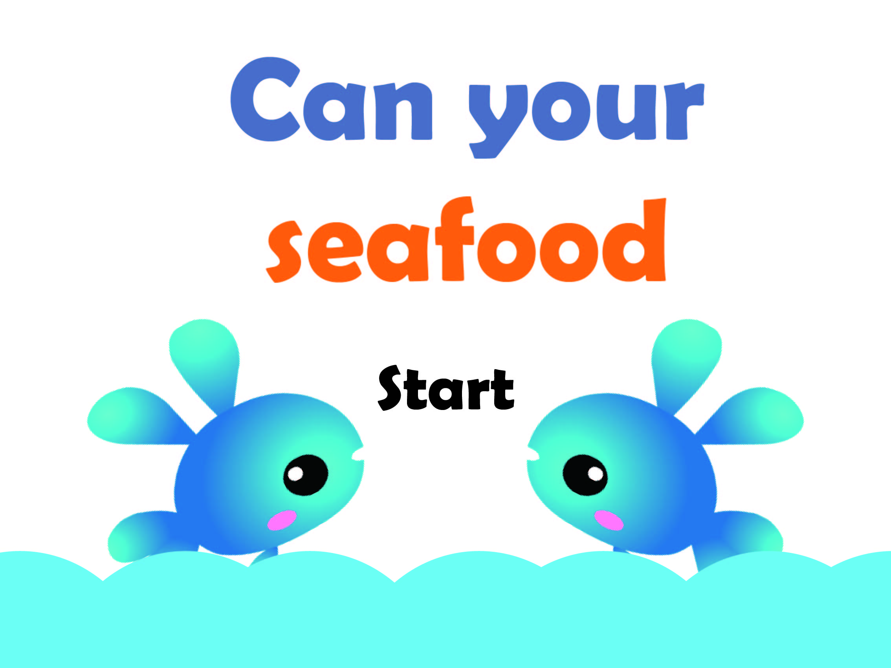
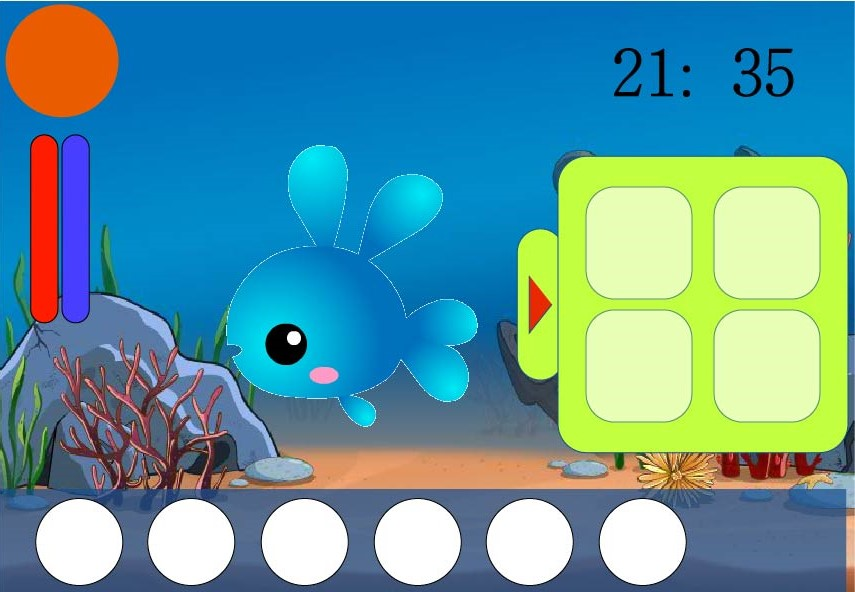

# Proposal
- 組別3
- 組員：李泓燁、邱詠智、楊鈞愷
- 遊戲名稱：Can Your Seafood?

## 遊戲描述
- 遊戲性質：溫馨療癒的養成遊戲
- 遊戲目標：藉由跟寵物互動，提升跟寵物的好感值
- 流程：取名字，換裝，互動，腳踏車

## 主架構

## Class列表和簡介
- `GameControl`：用有限狀態機維護遊戲運行到哪個階段
- `Interface`：對於每個階段的遊戲畫面建立專屬的class，`Interface`為 Virtual Class
	- `Opening`：開頭動畫/選單
	- `Naming`：取名字的遊戲階段
	- `Gaming`：跟寵物互動、增加感情的階段
	- `Ending`：遊戲結束，restart
- `Circle`：座標(x, y, r)，做為Object裡面的元素
- `Object`：對於每個遊戲物件都建立專屬的class，`Object`為Virtual Class
	- `Button`：按鈕
	- `Pet`：可愛的萌寵
	- `Ball`：跟你的萌寵玩球球
	- `Food`：餵你的萌寵吃好料
	- `Slider`：滑桿，控制音量大小之類的
	- `Textbox`：讓你輸入可愛萌寵的名字
- `KeyIn`：鍵盤輸入，把吃到的`ALLEGRO_KEYCODE`轉成c++ string

## 預覽圖
- 開始畫面

- 遊戲畫面
